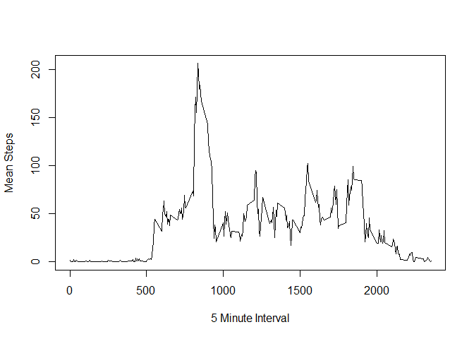

# Peer Assessment 1
brilliancy  
Sunday, July 20, 2014  

##Loading and preprocessing the data

```r
table <- read.csv("activity.csv", header=TRUE)
```
##What is mean total number of steps taken per day?
###Make a histogram of the total number of steps taken each day

```r
library(ggplot2)
```

```
## Warning: package 'ggplot2' was built under R version 3.1.1
```

```r
countSteps <- aggregate(steps ~ date, table, sum)  
ggplot(countSteps, aes(x=steps)) + geom_histogram()
```

```
## stat_bin: binwidth defaulted to range/30. Use 'binwidth = x' to adjust this.
```

 
###Calculate and report the mean and median total number of steps taken per day

```r
mean(countSteps$steps)
```

```
## [1] 10766
```

```r
median(countSteps$steps)
```

```
## [1] 10765
```
##What is the average daily activity pattern?
###A time series plot (i.e. type = "l") of the 5-minute interval (x-axis) and the average number of steps taken, averaged across all days (y-axis)

```r
avg_steps<- aggregate(.~interval, FUN=mean, data=table)
with(avg_steps, plot(interval, steps, type="l", xlab= "5 Minute Interval", ylab="Mean Steps"))
```

 
###Which 5-minute interval, on average across all the days in the dataset, contains the maximum number of steps?

```r
subset(avg_steps, select= interval, subset= (steps == max(avg_steps$steps)) )
```

```
##     interval
## 104      835
```

##Inputing missing values
###Calculate and report the total number of missing values in the dataset 

```r
nrow(subset(table, subset=is.na(table$steps)))
```

```
## [1] 2304
```
###Devise a strategy for filling in all of the missing values in the dataset. The strategy does not need to be sophisticated. For example, you could use the mean/median for that day, or the mean for that 5-minute interval, etc.
-I subsetted NA values
-Merged NA values with mean steps per day.
-Then ommited nA values from original set to make new_table. 
-Then I rbinded the NA filled in set with new_table

```r
na_values<- subset(table, subset=is.na(table$steps))
avg_steps_int<- avg_steps[,1:2]
NA_newvalues<-merge(na_values, avg_steps_int, by="interval")
clean_NA<- NA_newvalues[,c(1,3,4)]
names(clean_NA)[names(clean_NA)=="steps.y"] <- "steps"
clean_NA<- clean_NA[,c(3,2,1)]
new_table<- na.omit(table)
new_table<- rbind(new_table,clean_NA)
```
###Make a histogram of the total number of steps taken each day and Calculate and report the mean and median total number of steps taken per day.

```r
library(ggplot2)
new_countSteps<-aggregate(steps ~ date, new_table, sum)  
ggplot(new_countSteps, aes(x=steps)) + geom_histogram()
```

```
## stat_bin: binwidth defaulted to range/30. Use 'binwidth = x' to adjust this.
```

 

```r
new_countSteps <- aggregate(steps ~ date, new_table, sum)  
mean(new_countSteps$steps)
```

```
## [1] 10766
```

```r
median(new_countSteps$steps)
```

```
## [1] 10766
```
The mean is the same, however the median in the new data set is slightly bigger.The impact of inputting missing data is pretty minimal. 

##Are there differences in activity patterns between weekdays and weekends?
###Create a new factor variable in the dataset with two levels - "weekday" and "weekend" indicating whether a given date is a weekday or weekend day.

```r
date_table<- transform(new_table, weekend=as.POSIXlt(date, format='%F')$wday %in% c(0, 6))
date_table$dayOfWeek <- "weekday"
weekend <- weekdays(as.Date(date_table$date)) %in% c("Saturday", "Sunday")
date_table$dayOfWeek[weekend == TRUE] <- "weekend"

weekend_table<- date_table[date_table$weekend == TRUE,]
weekday_table<- date_table[date_table$weekend == FALSE,]
```


